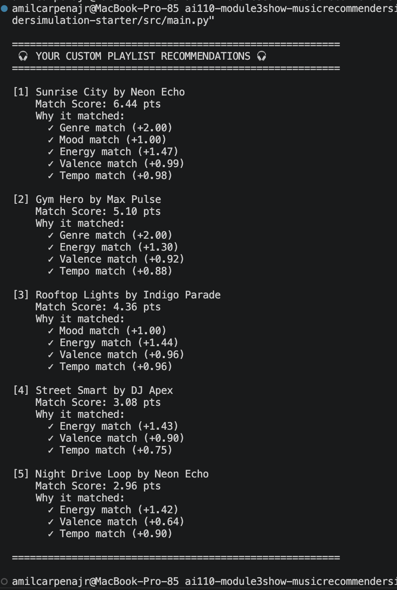

# 🎵 Music Recommender Simulation

## Project Summary

In this project you will build and explain a small music recommender system.

Your goal is to:

- Represent songs and a user "taste profile" as data
- Design a scoring rule that turns that data into recommendations
- Evaluate what your system gets right and wrong
- Reflect on how this mirrors real world AI recommenders

Replace this paragraph with your own summary of what your version does.

---

## How The System Works

In my recommendation design, a `Song` acts as a data container that uses continuous audio traits—like energy, valence, danceability, acousticness, and scaled tempo—for mathematical matching, alongside descriptive metadata tags like genre and mood for basic sorting. 

To figure out what a listener wants, the system relies on a `UserProfile` that stores their current ideal listening state, which includes specific numerical values the user is currently in the mood for (like a target energy level of 0.8). It also stores any active category filters they have turned on, such as restricting the search to only "lofi" tracks.

When it is time to compute a score for each track, the recommender calculates the mathematical distance between the user's ideal target numbers and the song's actual numbers across all those features, ultimately converting that gap into an intuitive percentage where a closer distance equals a higher match score. 

Finally, to choose which songs to actually present, the system first eliminates any tracks that violate the user's active filters, sorts the remaining candidates from the highest match score to the lowest, and applies a final ranking logic to ensure the top results offer a diverse mix of artists for an enjoyable playlist.

### Recommender System Architecture Plan

**Algorithm Recipe (Scoring Logic)**
For each song, calculate a total score starting at 0:
* **Genre Match:** +2.0 points for an exact match.
* **Mood Match:** +1.0 point for an exact match.
* **Audio Trait Match:** For Energy, Valence, Danceability, Acousticness, and normalized Tempo, calculate proximity: `(1.0 - |Target - Actual|)`.
* **Feature Weights:** Multiply the Energy proximity score by 1.5, Acousticness by 0.5, and the rest by 1.0. 
* **Ranking:** Sum all points to get the final score, then sort the catalog from highest to lowest.

**Potential Biases & Blind Spots**
* By heavily weighting the text tag (+2.0 for genre), the system will likely bury songs with a perfect mathematical audio vibe simply because they belong to a different category.
* Since the scoring is strictly content-based, it risks recommending a monotonous block of identical-sounding tracks by the same artist, ignoring the user's need for novelty or variety.

### CLI Verification



### Stress Test with Diverse Profiles


## Getting Started

### Setup

1. Create a virtual environment (optional but recommended):

   ```bash
   python -m venv .venv
   source .venv/bin/activate      # Mac or Linux
   .venv\Scripts\activate         # Windows

2. Install dependencies

```bash
pip install -r requirements.txt
```

3. Run the app:

```bash
python -m src.main
```

### Running Tests

Run the starter tests with:

```bash
pytest
```

You can add more tests in `tests/test_recommender.py`.

---

## Experiments You Tried

Use this section to document the experiments you ran. For example:

- What happened when you changed the weight on genre from 2.0 to 0.5
- What happened when you added tempo or valence to the score
- How did your system behave for different types of users

---

## Limitations and Risks

Summarize some limitations of your recommender.

Examples:

- It only works on a tiny catalog
- It does not understand lyrics or language
- It might over favor one genre or mood

You will go deeper on this in your model card.

---

## Reflection

Read and complete `model_card.md`:

[**Model Card**](model_card.md)

Write 1 to 2 paragraphs here about what you learned:

- about how recommenders turn data into predictions
- about where bias or unfairness could show up in systems like this


---

## 7. `model_card_template.md`

Combines reflection and model card framing from the Module 3 guidance. :contentReference[oaicite:2]{index=2}  

```markdown
# 🎧 Model Card - Music Recommender Simulation

## 1. Model Name

Give your recommender a name, for example:

> VibeFinder 1.0

---

## 2. Intended Use

- What is this system trying to do
- Who is it for

Example:

> This model suggests 3 to 5 songs from a small catalog based on a user's preferred genre, mood, and energy level. It is for classroom exploration only, not for real users.

---

## 3. How It Works (Short Explanation)

Describe your scoring logic in plain language.

- What features of each song does it consider
- What information about the user does it use
- How does it turn those into a number

Try to avoid code in this section, treat it like an explanation to a non programmer.

---

## 4. Data

Describe your dataset.

- How many songs are in `data/songs.csv`
- Did you add or remove any songs
- What kinds of genres or moods are represented
- Whose taste does this data mostly reflect

---

## 5. Strengths

Where does your recommender work well

You can think about:
- Situations where the top results "felt right"
- Particular user profiles it served well
- Simplicity or transparency benefits

---

## 6. Limitations and Bias

Where does your recommender struggle

Some prompts:
- Does it ignore some genres or moods
- Does it treat all users as if they have the same taste shape
- Is it biased toward high energy or one genre by default
- How could this be unfair if used in a real product

---

## 7. Evaluation

How did you check your system

Examples:
- You tried multiple user profiles and wrote down whether the results matched your expectations
- You compared your simulation to what a real app like Spotify or YouTube tends to recommend
- You wrote tests for your scoring logic

You do not need a numeric metric, but if you used one, explain what it measures.

---

## 8. Future Work

If you had more time, how would you improve this recommender

Examples:

- Add support for multiple users and "group vibe" recommendations
- Balance diversity of songs instead of always picking the closest match
- Use more features, like tempo ranges or lyric themes

---

## 9. Personal Reflection

A few sentences about what you learned:

- What surprised you about how your system behaved
- How did building this change how you think about real music recommenders
- Where do you think human judgment still matters, even if the model seems "smart"

